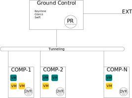

# Architecture

[//]: <> (**pré requis** : ML2-plugin, OpenvSwitch, VXLAN)

**Pour rappel** l'architecture, doit repondre aux objectifs selon `/doc/0_Intro/0_Presentation.md` : 
- KISS
- Security Focus

L'énoncé est orienté vers des déploiements de VM principalement. Autrement dit, l'architecture mettra en avant Les **Compute Node**.  
Un exemple typique : 
> un enseignant fait cours sur linux pour une classe, il est capable d'instancier 24 ubuntu en un clique et à la fin du cours supprimer toutes ces VM.

Une des propositions, non détaillé ici, serait d'utiliser seulement un seul et unique nœud OpenStack. Cette architecture serait grandement déprécié car elle n'est pas scalable et non performantes (raison détaillé plus tard).

## Solution : architecture DVR OpenvSwitch

L'architecture est composée de :
- 1 Controle-Node (ici appelé *Ground Control*) : il gère la majeur partie avec l'authentification, etc...
- N Compute-Node (ici appelé *COMP-#*) : où les VM seront exécutés.

Cette architecture est scalable, le jour où la puissance de calcul n'est plus suffisante alors il suffira de déployer un nouveau Compute-Node.  
Chaque Compute-Node posséde un routeur (DVR). Si les DVR étaient absents alors tout les flux qu'ils soient Nord-Sud (VM vers EXT) ou EST-OUEST (inter-NETWORK et intra-NETWORK) passerait à travers le Principal Router (PR) ce qui alourdi la charge réseau. Les DVR (Distributed Virtual Routing) quand à eux sont là pour gérer les connexions EST-OUEST et ainsi le PR ne se concentre que sur les connexions NORD-SUD. Les DVR sont vu par OpenStack comme un seul routeur, ce qui permet que deux VM jaune (connecté aux network jaune) qui ne sont pas sur le même Compute-Node puissent interagir.

### Sécurité

Des FW sont mit en place sur :
- PR : ainsi protégé le trafics NORD-SUD et attaque extérieur
- DVR : (*rappel vu comme un seul routeur*) pour protégé les trafics EST-OUEST

Ainsi les règles de sécurité des FW sont centralisées et simplifiées. Étant donnés la simplicité, la configuration des règles FW respecteront le principe DRY (*Don't Repeate Yourself*). Ce qui permet une meilleur consistance des règles FW.

### Avantages

Premièrement il respecte les objectifs fixés. 
- KISS : modularité des nœuds de calcul, avec une scalabilité
- Security Focus : les règles de par feux sont centralisées sur le DVR et sur le PR. (avec la possibilité d'ajout des Security Group)
- High Availability : les connexions EST-OUEST sont allégé par les DVR
- Fault Tolerence : si un compute node cesse de fonctionné alors il n'impactera pas le reste

### Inconvénients

Majeur :
- High Availability : au niveau NORD-SUD les connexions seront ralentis car tout les flux des VM passeront par un seul routeur ici PR. Dans l'énoncé posé, ceci n'est un problème que lorsque les VM font des mise à jour collectivement et souvent sur le même repository, on peut contrer ce problème en installant un proxy cache (mise en cache de data temporairement pour augmenter la rapidité de l'accessibilité) au seins d'OpenStack.  

Mineur :
- Fault Tolerence : si Ground Control tombe en panne toute l'infrastructure tombe aussi car Keystone sera absent. Mais les connexions EST-OUEST fonctionneraient encore. Il suffirait de redéployer Ground Control à partir d'une snapshot fonctionnelle.
- Fault Tolerence : si un compute node meurt alors ses donnés sont perdu. Pour y remédier il suffit de faire du mirroring (duplication de donnés en temps réel) avec Cinder. Où faire des snapshot avec Swift toutes les intervallent de temps.

